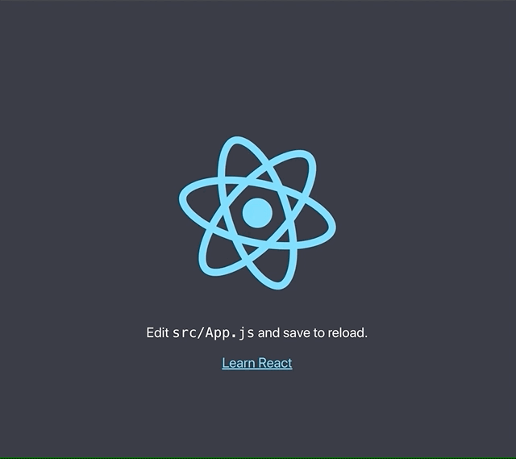
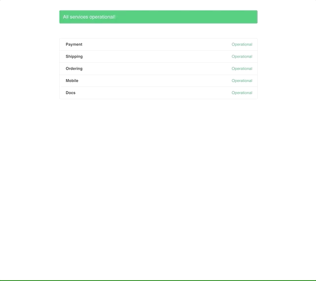

[](https://img.shields.io/travis/katiawheeler/healthy.svg?style=flat-square)
[](https://img.shields.io/bundlephobia/min/react-healthy.svg?style=flat-square)
[](https://img.shields.io/github/issues/katiawheeler/healthy.svg?style=flat-square)

Healthy is a react-based health check application for the APIs serving your client application. Quickly alert your users to API issues.

# Table of Contents

- [Installation](#Installation)
- [Usage](#Usage)
- [Documentation](#Documentation)

---

# Installation

```bash
npm i react-healthy
```

or

```bash
yarn add react-healthy
```

---

# Usage

You can import one of the pre-made react components from the package or the functionality to create your own status page or banner. The only thing you need to adhere to is the shape of the APIs you pass in.

```ts
interface Api {
  /** Name of the API - to be displayed in the banner **/
  name: string;
  /** Endpoint of the API to ping **/
  endpoint: string;
  /** Custom message to be displayed when there's an error **/
  message?: string;
}
```

There are three exports that you can utilize:

- [`Healthy` (a banner)](##Healthy)
- [`StatusPage`](##StatusPage)
- [`begin`](##begin)

---

## Healthy



The `Healthy` component is a banner that will display at the top of your application, alerting your users to any issues with the APIs you pass in. It takes in the following prop options:

```ts
interface HealthyProps {
  /** An array of API objects */
  apis: Api[];

  /** A callback that's called after the component handles the error, for additional error handling */
  onError?: Handler;

  /** The interval at which to call the APIs in milliseconds - default is 30 seconds (30000) */
  interval?: number;

  /** A callback to handle all responses that are not errors
   */
  onResponse?: Handler;

  /** CSS class names to assign to the banner, banner content, and close button */
  classes?: {
    banner?: string;
    content?: string;
    closeButton?: string;
  };

  /** Whether or not to show a close icon - default is false */
  closable?: boolean;
}
```

### Basic Usage

Simply import the `Healthy` component in your main container (your `Root` file or wherever you are utilizing `ReactDOM.render`), and pass in an array of `Api` objects.

Example:

```jsx
// index.js - generated by CRA and modified

// other imports
import { Healthy } from 'react-healthy';

const myAppsApis = [
  {
    name: 'Api1',
    endpoint: 'https://httpstat.us/200'
  },
  {
    name: 'Api2',
    endpoint: 'https://httpstat.us/500'
  }
];

ReactDOM.render(
  <>
    <Healthy apis={myAppsApis} />
    <App />
  </>
  , document.getElementById('root'));

```

### Advanced Usage

The `Healthy` component allows you to pass in an `onError` and an `onResponse` handler. These are called **after** the banner component handles the error internally (displaying itself). These handlers will allow you to make any adjustments in your application as needed. A handler needs to be able to take in an `Api` object and a `Response` object.

```ts
type Handler = (api: Api, response: Response) => void;

interface Api {
  /** Name of the API - to be displayed in the banner **/
  name: string;
  /** Endpoint of the API to ping **/
  endpoint: string;
  /** Custom message to be displayed when there's an error **/
  message?: string;
}

interface Response {
  /** HTTP Error Code **/
  code: number;
  /** Status message **/
  message: string;
}
```

In addition, the `Api` objects that `Healthy` accepts can contain their own custom mesage. If that API errors, the message will be displayed in the banner instead of the default.


### Note

If more than one API errors, a generic message will be displayed in the `Healthy` component.


---

## `StatusPage`



The `StatusPage` is a page level component that displays a list of your APIs and their statuses. It takes in the following prop options:

```ts
interface StatusPageProps {
  /** An array of API objects */
  apis: Api[];
  /** The interval at which to call the APIs in milliseconds - default is 30 seconds (3000) */
  interval?: number;
}
```

### Two Ways to Use

There are two ways to use the `StatusPage` component. 

#### First Method

The first is to pass the `StatusPage` component to `react-router`'s `Route` component like so:

```jsx
// other imports
import { Route } from 'react-router';
import { StatusPage } from 'react-healthy';

const myAppsApis = [
  {
    name: 'Api1',
    endpoint: 'https://httpstat.us/200'
  },
  {
    name: 'Api2',
    endpoint: 'https://httpstat.us/500'
  }
];

// other functionality

<Route path="/status" exact render={() => <StatusPage apis={myAppsApis} />} />

// continued functionality
```

#### Second Method

The second method of using the `StatusPage` component would be to create a containing component within your application. This is the component that your route would point to. Then, you would have the `StatusPage` be a child of that component.

Example:

```jsx
// other imports
import { StatusPage } from 'react-healthy';

export const MyContainerComponent = () => {
  const myAppsApis = [
  {
    name: 'Api1',
    endpoint: 'https://httpstat.us/200'
  },
  {
    name: 'Api2',
    endpoint: 'https://httpstat.us/500'
  }
];

return <>
    <StatusPage apis={myAppsApis} />>
  </>

}
```

---

## `begin`

`begin` is the function where all the magic happens. You can import the function directly into your application and create your own status page or banner component.

`begin` is an asynchronous function that takes in the following arguments:

```ts
const begin = async(apis: Api[], onError: Handler, interval?: number, onResponse?: Handler) => void;
```

If no `interval` argument is passed, the default of 30 seconds (3000 milliseconds) is used.

### Using `begin`

Simply import the `begin` function and call it in `componentDidMount` to get the cycle going.

Example:

```jsx
// other imports
import { begin } from 'react-healthy';

export class MyAwesomeComponent extends React.Component {
  handleOnError = error => console.log(error);
  
  myAppsApis = [
  {
    name: 'Api1',
    endpoint: 'https://httpstat.us/200'
  },
  {
    name: 'Api2',
    endpoint: 'https://httpstat.us/500'
  }
];

  componentDidMount() {
    await begin(this.myAppApis, this.handleOnError);
  }

  render() {
    return // stuff
  }
}
```

---

# Documentation

- [Types](##Types)
  - [Api](###Api-Interface)
  - [Response](###Response-Interface)
  - [Handler](###Handler-Type)
- [Components](##Comeponents)
  - [Healthy](###Healthy-Component)
  - [StatusPage](###StatusPage-Component)
- [Functions](##Functions)
  - [`begin`](###begin-function)

---

## Types

### Api Interface

Interface for Api object

```ts
interface Api {
  /** Name of the API - to be displayed in the banner **/
  name: string;
  /** Endpoint of the API to ping **/
  endpoint: string;
  /** Custom message to be displayed when there's an error **/
  message?: string;
}
```

### Response Interface

Interface for Response object, in the context of `react-healthy`


```ts
interface Response {
  /** HTTP Error Code **/
  code: number;
  /** Status message **/
  message: string;
}
```

### Handler Type

Type for handler functions

```ts
type Handler = (api: Api, response: Response) => void;
```

---

## Components

### `Healthy` Component

A banner component that appears if there is an issue with an API. If more than one API errors, a generic error message will appear.

#### `Healthy` Props

| Name          | Required | Default | Type                         | Description    |
| ------------- |:--------:| :-----: | -----                        | ---------------|
| apis          |  x       |         | `Api[]` | An array of APIs to call at an interval
| onError       |          |         | `Handler` | A handler for when there's an error
| interval      |          |   30000 | `number` | An interval to ping the APIs at
| onResponse    |          |         | `Handler` | A handler for any response from the API (regardless of error)
| classes       |          |         | `{ banner?: string; content?: string, closeButton?: string }` | CSS classes to apply to the component's different parts
| closeable     |          |   false | `bool` | Whether or not the banner can be dismissed

### `StatusPage` Component

#### `StatusPage` Props

| Name          | Required | Default | Type                         | Description    |
| ------------- |:--------:| :-----: | -----                        | ---------------|
| apis          |  x       |         | `Api[]` | An array of APIs to call at an interval
| interval      |          |   30000 | `number` | An interval to ping the APIs at

---

## Functions

### `begin` Function

`begin` is a function that is called at an interval to check the statuses of the APIs passed in.

#### Arguments

| Name          | Required | Default | Type                         | Description    |
| ------------- |:--------:| :-----: | -----                        | ---------------|
| apis          |  X       |         | `Api[]` | An array of APIs to call at an interval
| onError       |   X      |         | `Handler` | A handler for when there's an error
| interval      |          |   30000 | `number` | An interval to ping the APIs at
| onResponse    |          |         | `Handler` | A handler for any response from the API (regardless of error). Will be called after the function handles the response. If there is an error, `onResponse` will not be called.